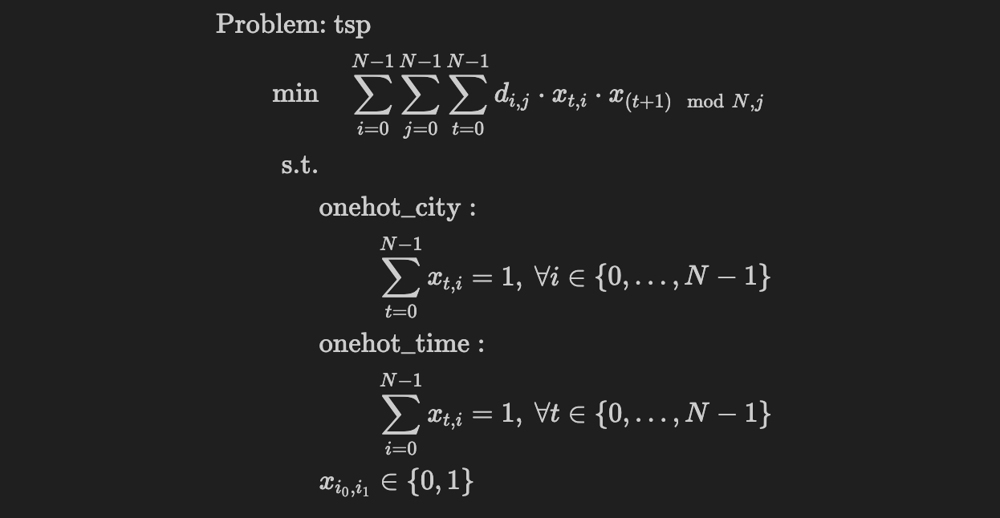
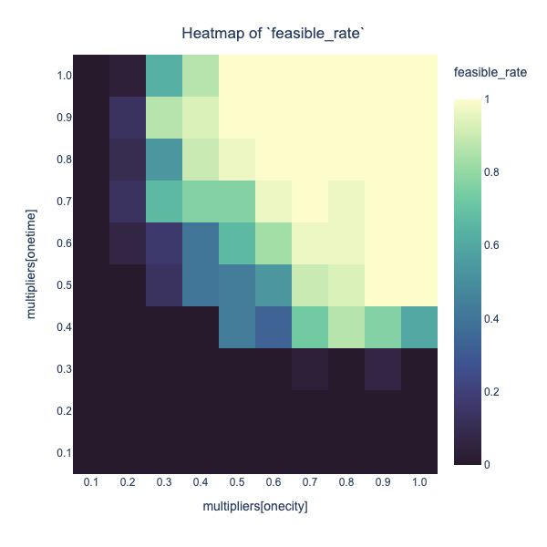
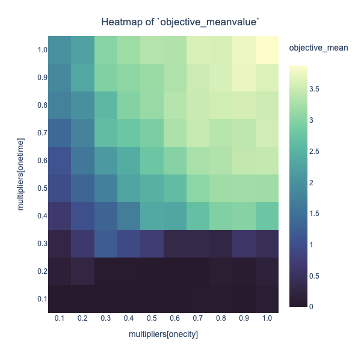
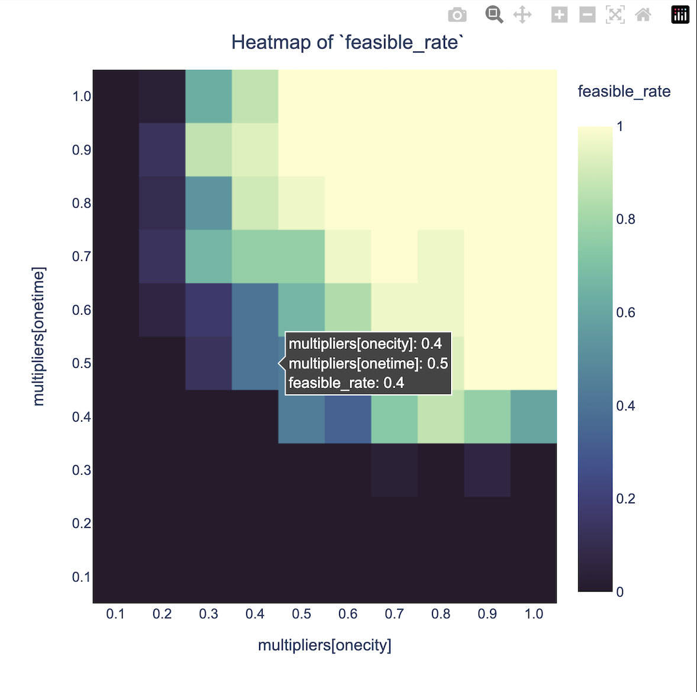
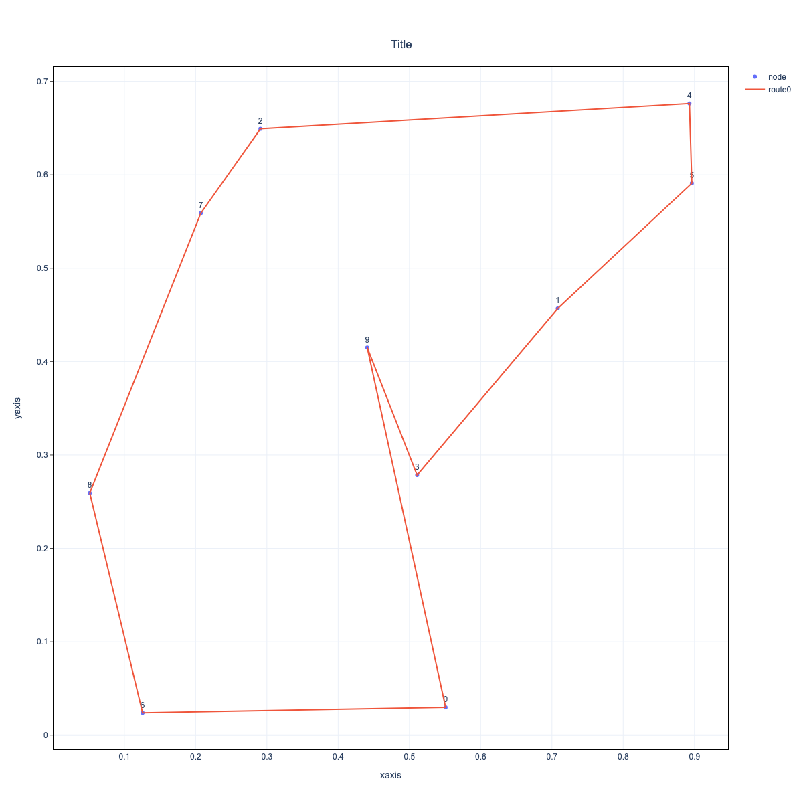

# Abstract
In this chapter, we will show an example of use of JijBench with the parameter search for the traveling salesman problem.

To get a better solution in optimization, it's often necessary to adjust the parameters.
In Ising optimization of TSP, we need to adjust parameters that determines the weights of the constraints in order to get a better feasible solution.
We use grid search to determine the multiplier, and JijBench simplifies this process.


# Introduction to the Traveling Salesman Problem (TSP)

First, we introduce the Traveling Salesman Problem (TSP) and formulate it as a mathematical optimization problem.

## What is the TSP ?
TSP is the problem of minimizing the distance traveled by a salesman who starts from a certain city, visits the cities one by one, and finally returns to the starting city.

## Formulating TSP as a Mathematical Optimization Problem
Let's formulate the TSP in the case when a single salesman travels N cities as a mathematical optimization problem. Let

- $`i\in\{1, \cdots, N\}`$ denote each $`N`$ city,
- $`d_{ij}`$ denote the distance between city $`i`$ and $`j`$
- $`x_{t,i}`$　be the binary variable defined as below:

```math
x_{t,i} :=
\begin{cases}
1 & (\text{the salesman visit city $i$ at the $t$-th step}), \\
0 & (\text{otherwise}).
\end{cases}
```
Then, when the salesman visit city $`i`$ at the $`t`$-th step and city $`j`$ at the $`(t+1)`$-th step, the travel distance is 
```math
d_{ij}x_{t,i}x_{t+1,j}.
```

Therefore, noting that $`(N+1)`$-th city is the first city, total travel distance traveled around those $`N`$ cities is expressed as

```math
\sum_{t=1}^{N}\sum_{i=1}^{N}\sum_{j=1}^{N}d_{ij}x_{t,i}x_{(t+1\mod N),\,j}. 
```
Our aim is minimizing value of this function.
But, in this setting, we have two constraint.

1. Location constraint (onehot_city condition): only once the salesman visit each city;
```math
\sum_{t=1}^{N}x_{t,i} = 1 \quad (\forall i\in\{1, \cdots, N\}).
```
2. Time constraint (onehot_time condition): only one city is visited by the salesman at a time;
```math
\sum_{i=1}^{N}x_{t,i} = 1 \quad (\forall t\in\{1, \cdots, N\}).
```

Hence TSP is formulated as a constrained optimization problem to find $`\{x_{t,i}\}_{(t,i)}`$ that minimizes the value of the objective function under these constraints.

# Optimization with Jij's Product

Using Jij's products, we construct the mathematical model of TSP formulated above, convert it to QUBO, and perform Ising optimization.

For more details about each product, please refer to the following documents: [OpenJij](https://openjij.github.io/OpenJij/index.html), [JijModeling](https://www.documentation.jijzept.com/docs/jijmodeling/), [JijModeling-Transpiler](https://www.documentation.jijzept.com/docs/jijmodelingtranspiler/).

First, install the required packages.

```bash
pip install jijmodeling
pip install openjij
pip install jijmodeling.transpiler
pip install jijbench
pip install numpy
pip install matplotlib.pyplot
pip install itertools
```

## Constructing the Mathematical Model with JijModeling
We construct the mathematical model of TSP by JijModeling.

JijModeling is a modeling tool to describe optimization problems. 
JijModeling enable us to consturct mathematical model with an intuitive interface that is similar to mathematical formulas.

Then we can construct the mathematical model of TSP as follows:

```python
import jijmodeling as jm

def tsp_model():
    # 2-dimensional array that represents the distances between each city
    d = jm.Placeholder("d", dim=2) 
    # number of cities
    N = d.shape[0].set_latex("N") 
    # n×n matrix with binary variable component represented by 2-dimensional array
    x = jm.Binary("x", shape=(N, N)) 
    # domain of index i,j
    i, j = jm.Element("i", N), jm.Element("j", N) 
    # domain of index t
    t = jm.Element("t", N) 
    
    problem = jm.Problem("tsp")
    # objective function
    problem += jm.Sum([i, j, t], d[i,j] * x[t, i] * x[(t+1)%N, j]) 
    # onehot_city constraint
    problem += jm.Constraint("onehot_city", jm.Sum(i, x[t, i]) == 1, forall=t) 
    # onehot_time constraint
    problem += jm.Constraint("onehot_time", jm.Sum(t, x[t, i]) == 1, forall=i) 

    return problem

problem = tsp_model()
```

We can check the model constructed by JijModeling in LaTeX format on notebook.

```python
problem
```



The mathematical model of TSP has been constructed.

## Setting Problem Data

Next we define a funciton that gives positions of cities and distances between each cities.

We don't have specific distribution of cities, so we take points that represents cities at random.

```python
import numpy as np

def tsp_distance(N):
    np.random.seed(3)
    # take N points on x-axis at random
    x = np.random.uniform(0, 1, N) 
    # take N points on y-axis at random
    y = np.random.uniform(0, 1, N) 
    XX, YY = np.meshgrid(x, y) 
    # calculate distances between each cities
    distance = np.sqrt((XX - XX.T)**2 + (YY - YY.T)**2) 
    return distance, (x, y)
```

Defined function `tsp_distance` performs following procedure.

1. Recieve number of cities $`N`$.
2. Take $`N`$ cities on $`x`$-$`y`$ plane at random.
3. Calculate the distances between each cities $`d_{i,j}`$.
4. Return a matrix which has $`d_{i,j}`$ as $`(i,j)`$ elements and coordinates of cities. 

We use the information of coordinate of cities later when we plot the route outputted by optimization.

## Ising Optimization via QUBO Formulation

Now that let us define a function that perform optimization of TSP.

There are many methods to solve optimization problems. In this case, we adopt the method that involves transpiling the mathematical model to QUBO and performing Ising optimization on it. In this process, we use JijModeling-Transpiler and OpenJij.

### QUBO Formulation

Before defining a function to perform optimization, let us introduce QUBO formulation.

To solve constrained optimization problem such as TSP, we need to transpile them to formulation that has no constraint, called QUBO (Quadoratic Unconstraint Binary Optimization)  

When one transpiles constrained optimization problems such as TSP, it is common to add terms that square each constraint to the objective function, so that the objective function incorporates information about the constraints. This method is called the Penalty method.

In this case, our modified objective function take form as below:

```math
\begin{align*}
H(\{x_{t,i}\}) = \sum_{i=0}^{N-1}\sum_{j=0}^{N-1}\sum_{t=0}^{N-1}d_{i,j}x_{t,i}x_{t+1,j} + \sum_{i=0}^{N-1}A_{i}\left(\sum_{t=0}^{N-1}x_{t,i}-1\right)^{2} + \sum_{t=0}^{N-1}B_{t}\left(\sum_{i=0}^{N-1}x_{t,i}-1\right)^{2}
\end{align*}
```

Note that 

- the second term of right hand side $`\sum_{i=0}^{N-1}A_{i}\left(\sum_{t=0}^{N-1}x_{t,i}-1\right)^{2}`$ represents the penalty about the "onehot_city" constraint, 
- the third term $`\sum_{t=0}^{N-1}B_{t}\left(\sum_{i=0}^{N-1}x_{t,i}-1\right)^{2}`$ represents the penalty the "onehot_time" constraint,
- the constants $`\{A_{i}\}_{i=0}^{N-1}, \{B_{t}\}_{t=0}^{N-1}`$ are multipliers.

By applying Ising optimization to this new objective function, we can expect to find a good solution that satisfies the constraints and aims to lower the value of the objective function.

### Transpiling to QUBO by JijModeling-Transpiler and Ising Optimization by OpenJij

Now that we define a function that transpiles the mathematical TSP model to QUBO and performs Ising optimization of it.

In order to achieve this aim, we use JijModeling-Transpiler and OpenJij. JijModeling-Transpiler is a transpiler that convert mathematical models constructed by JijModeling into other formats such as QUBO and PUBO. OpenJij is a heuristic optimization library of the Ising model and QUBO.

Using these library, we define a fuction `tsp_solver` that performs following procedure.

1. Recieve following data and compile them; 
    - mathematical model constructed by JijModeling (`problem`)
    - problem data
        - number and distribution of cities (`instance_data`)
        - multipliers (`multipliers`)
    - number of calculation results we get (`num_reads`)
2. Transpile compiled data into QUBO by JijModeling-Transpiler.
3. Ising optimization of obtained QUBO by OpenJij and get the response.
4. Decode the response and return results.

This is coded as follows.

```python
import jijmodeling.transpiler as jmt
import openjij as oj

def tsp_solver(problem, instance_data, multipliers, num_reads):
    compiled_model = jmt.core.compile_model(problem, instance_data)
    pubo_builder = jmt.core.pubo.transpile_to_pubo(compiled_model)
    Q,offset = pubo_builder.get_qubo_dict(multipliers=multipliers)
    sampler = oj.SASampler(num_reads=num_reads)
    response = sampler.sample_qubo(Q=Q)
    result = jmt.core.pubo.decode_from_openjij(response, pubo_builder, compiled_model) 
    return result
```

A few more explanation about the arguments of `tsp_solver`.

- `problem`: a mathematical model of TSP constructed by JijModeling.
- `instance_data`: a dictionary that contains two key-value pairs; one is about the number of cities, and the other is about the distances between each city.
- `multiplier`: a dictionary that contains key-value pairs whose keys are the name of the constraints and corresponding values are the numerical values of multiplier.
- `num_read`:  a numerical value that represents the number of samples (calculation results) we get. Ising optimization is heuristic stochastic algorithms, for this reason, we get several samples.  

Show an example of `tsp_solver` usage.

```python
problem = tsp_model()
# number of cities
N_sample = 10 
d_sample, positions_sample = tsp_distance(N_sample) 
instance_data_sample = {"N":N_sample, "d":d_sample} 
multipliers_sample = {"onehot_city":1.0,"onehot_time":1.0} 
num_reads_sample = 30

result_sample = tsp_solver(problem, instance_data_sample, multipliers_sample, num_reads_sample)
```

<!-- Note that `multipliers_sample = {"onehot_city":1.0,"onehot_time":1.0}` means that we set $`A_{i} = 1 \,\,(\forall i)`$ and $`B_{t} = 1 \,\, (\forall t)`$. -->

# Parameter Search and Benchmark by JijBench

As the main subject of this chapter, we will demonstrate parameter search using JijBench.
We will show the parameter search for TSP with varying the multipliers as an example.

## Purpose of Parameter Search

Before performing a parameter search for multipliers, let us explain the reason for this.

Multipliers are constants by which squared constraints terms are multiplied. 
Thus the larger multiplier, the greater the penalty for violating the constraints. 
As a result, the larger the multiplier, the more the solver tries to avoid penalty and it gets easier for us to get feasible solutions (solutions that satisfy the constraints). 

However, at this time, minimization of the total travel distance, which is the original objective function of TSP, is not focused on.
Therefore, it is necessary for us to adjust multipliers to obtain a feasible solution with a small travel distance.
In the previous example of the use of `tsp_solver`, both "onehot_time" and "onehot_city" were set to $`1.0`$,  but we are goint to perform parameter tuning by gridsearch to find a better multiplier pair.

JijBench strongly supports us to do this process. 

## Creation of a Dictionary of Parameters to Be Varied

First, we create a dictionary that contain parameters to be varied.
In this case, we vary only multipliers, remain distribution of cities.

Take an example list of values that will be substituted into multipliers as follows:

```python
import itertools

onehot_city_multipliers = [0.1, 0.2, 0.3, 0.4, 0.5, 0.6, 0.7, 0.8, 0.9, 1.0]
onehot_time_multipliers = [0.1, 0.2, 0.3, 0.4, 0.5, 0.6, 0.7, 0.8, 0.9, 1.0]
multipliers_list = [{"onehot_city":p0, "onehot_time":p1} for p0, p1 in itertools.product(onehot_city_multipliers, onehot_time_multipliers)]
```

Let the other data,  such as number of cities, distance between cities, number of iterations, be set as in the previous example.

```python
N = 10 
d, positions = tsp_distance(N) 
instance_data = {"N":N, "d":d} 
num_reads = 30
```

## Demonstration of Parameter Search

Finaly, we demonstrate parameter search with JijBench. 

In order to do this, we construct instance of `jb.Benchmark` class by passing a function as `solver` and a dictionary as `params` to it. 

In our case, we use JijBench as follows:

```python
import jijbench as jb

bench = jb.Benchmark(
    solver=tsp_solver, 
    params={
        "problem":[problem],
        "instance_data":[instance_data],
        "multipliers":multipliers_list,
        "num_reads":[num_reads],
    }  
)
experiment = bench()
```

i.e. the function we pass is the function we want to observe the parameter search result. The dictionary we pass has key-value pairs whose keys are the names of arguments of the function and values are the lists that contain parameters.

We can check the result of this experiment as a pandas.DataFrame with the table method.

```python
df = experiment.table
df
```

# Observation of the Parameter Search Result

Let us check the parameter search results.

Apply `evaluation` for `experiment` and we can calculate various evaluation metrics.

```python
evaluation = jb.Evaluation()
eval_result = evaluation([experiment])

print(eval_result.table.columns)
```

As you can see, there are many evaluation metrics.

In this case, we observe how the ratio of feasible solutions (`feasible_rate`) to the all obtained solutions and the mean value of the objective function (`objective_mean`) change by plotting them on heatmaps.

## Plotting the Heatmap

To plot them on heatmaps, we use `HeatMap()`.
```python
from jijbench.visualization import HeatMap
```

Then apply `Heatmap()` for the `eval_result` and assign the items that you want to represent by color coding to `color_column`, the items you want to represent on the x-axis to `x_column`, and the items you want to represent on the y-axis to `y_column`.

```python
# heatmap of `feasible_rate`
heatmap = HeatMap(eval_result)
fig = heatmap.create_figure(
    color_column="feasible_rate",
    x_column="multipliers[onehot_city]",
    y_column="multipliers[onehot_time]",
    title_text = "Heatmap of `feasible_rate`",
)
fig.show()
```




```python
# heatmap of `objective_mean`
heatmap = HeatMap(eval_result)
fig = heatmap.create_figure(
    color_column="objective_mean",
    x_column="multipliers[onehot_city]",
    y_column="multipliers[onehot_time]",
    title_text = "Heatmap of `objective_meanvalue`",
)
fig.show()
```



Now let's look at this heat map to find the multiplier pairs for which a feasible solution has been found (i.e. `feasible_rate`$`>0`$) and for which the mean value of the objective function is the smallest.

There is a function useful to us that displays the parameters of the box domain you point to with the cursor in the heatmap, as shown in the figure below



Using this function to examine two heatmaps, find multipliers with the smallest mean value of the objective function among those for which feasible solutions have been obtained.

In this case it turns out that the best multipliers are `onehot_city`$`= 0.7`$, `onehot_time`$`=0.3 `$

> Please let me note that the algorithms handled by OpenJij are heuristic stochastic algorithms thus returned solution may differ by each try. However, major changes should not occur, and the results should be generally similar.

The return value of the solver and the sampleset for the multiplier pair $`(0.7,0.3)`$ are obtained as follows.

```python
# get the sampleset of specified multipliers
artifact, table = experiment.data
data = table.data.applymap(lambda x: x.data)
sampleset = data[data['multipliers'].apply(lambda x: x == {'onehot_city': 0.7, 'onehot_time': 0.3})]["solver_output[0]"][0]
```

The sampleset has the result for `num_reads` times. We can get the feasible solutions by `feasible()` method and furthermore the solution with the lowest objective function value among them by `lowest()` method.

```python
best_sample = sampleset.feasible().lowest()
```

Then let us plot the route of `best_sample` in the next section as the end of this chapter.

## Visualization of Route

JijBench has visualization tools too. Let us plot the obtained route of `best_sample` by JijBench.

First we represent the coordinates of cities as a dictionary and the obtained route as a list.

```python
# dictionary whose keys are indices of cities and values are coordinate of cities.
city_pos={i: pos for i, pos in enumerate(zip(*positions))}

# get the indices of cities and order.
(city_indices, order_indices), solution_value, solution_shape = best_sample.record.solution['x'][0] 
# sort the city indices in order of visitation.
sorted_city_indices = sorted(city_indices, key=lambda x: order_indices[x]) 
# add the first city to make the route a circuit.
solution_route = sorted_city_indices + sorted_city_indices[:1] 
```

Then to visualize this obtained route, create an instance of `Route` class. Then add information about nodes as dictionary data and vertex connecting nodes as tuple data to it, finaly plot them.

In our case, nodes are cities, vertices are parts of route.

```python
from jijbench.visualization import Route

# create an instance of `Route` class
route = Route(savefig=True) 
# add the information about the distribution of cities to the instance 
route.add_nodes(node_pos=city_pos)
# add the information about the route to the instance
route.add_route(route=solution_route, route_name="Solution Route") 

fig = route.create_figure( 
    title_text="Title",
    height=1200,
    width=1200,
    xaxis_title="xaxis",
    yaxis_title="yaxis",
    shownodelabel=True,
    showlegend=True,
    savedir=".",
    savename="Savename",
    savescale=1,
)
fig.show()
```



This route appear to travel around the cities fairly efficiently.