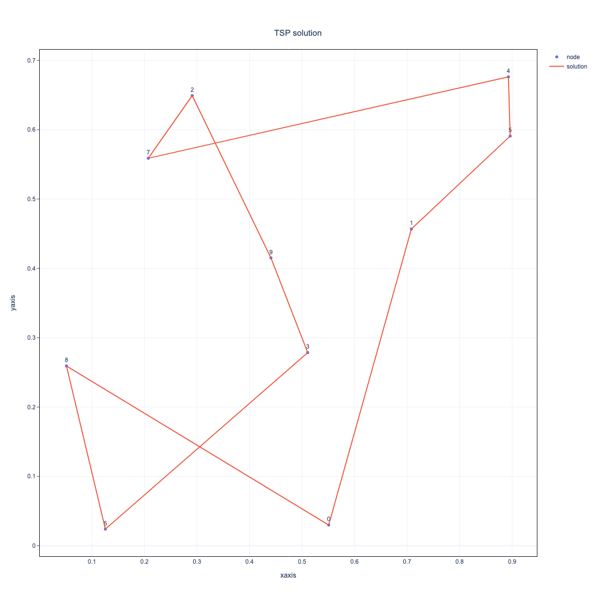

# Abstract
In this chapter, we will show an example of use of JijBench with the traveling salesman problem as an example.

We will compare a route derived from optimization calculations with a casually chosen multiplier with the optimal route found by benchmarking results of optimization calculations with varying multipliers.
Then we will confirm that the efficiency is improved as a result.


# Introduction to the Traveling Salesman Problem (TSP)

First, we introduce the Traveling Salesman Problem (TSP) and formulate it as a mathematical optimization problem.

## What is the TSP ?
TSP is the problem of minimizing the distance traveled by a salesman who starts from a certain city, visits the cities one by one, and finally returns to the starting city.

## Formulating TSP as a Mathematical Optimization Problem
Let's formulate the TSP in the case when a single salesman travels N cities as a mathematical optimization problem. Let

- $`i\in\{1, \cdots, N\}`$ denote each $`N`$ city,
- $`d_{ij}`$ denote the distance between city $`i`$ and $`j`$
- $`x_{t,i}`$　be the binary variable defined as below:

```math
x_{t,i} :=
\begin{cases}
1 & (\text{the salesman visit city $i$ $t$-th}), \\
0 & (\text{otherwise}).
\end{cases}
```
Then, when the salesman visit city $`i`$ $`t`$-th and city $`j`$ $`(t+1)`$-th the travel distance is 
```math
d_{ij}x_{t,i}x_{t+1,j}.
```

Therefore, noting that $`(N+1)`$th city is the first city, total travel distance traveled around those $`N`$ cities is expressed as

```math
\sum_{t=1}^{N}\sum_{i=1}^{N}\sum_{j=1}^{N}d_{ij}x_{t,i}x_{(t+1\mod N),\,j}. 
```
Our aim is minimizing value of this function.
But, in this setting, we have two constraint.

1. Location constraint (onehot_city condition): only once the salesman visit each city;
```math
\sum_{t=1}^{N}x_{t,i} = 1 \quad (\forall i\in\{1, \cdots, N\}).
```
2. Time constraint (onehot_time condition): only one city is visited by the salesman at a time;
```math
\sum_{i=1}^{N}x_{t,i} = 1 \quad (\forall t\in\{1, \cdots, N\}).
```

Hence TSP is formulated as a constrained optimization problem to find $`\{x_{t,i}\}_{(t,i)}`$ that minimizes the value of the objective function under these constraints.

# Optimization Calculations with Jij's Product

Using Jij's products, we construct the mathematical model of TSP formulated above, convert it to QUBO, and demonstrate the optimization calculations.

For more details about each product, please refer to the following documents: [OpenJij](https://openjij.github.io/OpenJij/index.html), [JijModeling](https://www.documentation.jijzept.com/docs/jijmodeling/), [JijModeling-Transpiler](https://www.documentation.jijzept.com/docs/jijmodelingtranspiler/).

First, install the required packages.

```bash
pip install jijmodeling
pip install openjij
pip install jijmodeling.transpiler
pip install jijbench
pip install numpy
pip install matplotlib.pyplot
pip install itertools
```

## Constructiong the Mathematical Model with JijModeling
We construct the mathematical model of TSP by JijModeling.

JijModeling is a modeling tool to describe optimization problems. 
When we use JijModeling, we make `jm.Problem` instance then add the objective functions and constraint represented by `jm.Constraint` instance to it.

We use classes the following classes:

- `jm.Placeholder`; represents constants,
- `jm.Binary`; represents binary variables,
- `jm.Sum`; represents summation, 
- `jm.Element`; represents range of indices summand over.

Then we can construct the mathematical model of TSP as follows:

```python
import jijmodeling as jm

def tsp_model():
    d = jm.Placeholder("d", dim=2) #各都市間の距離を表す2次元配列
    n = d.shape[0].set_latex("n") #都市の数
    x = jm.Binary("x", shape=(n, n)) #バイナリ変数のn行n列の2次元配列
    i, j = jm.Element("i", n), jm.Element("j", n)
    t = jm.Element("t", n)

    problem = jm.Problem("tsp")
    problem += jm.Sum([i, j, t], d[i,j] * x[i, t] * x[j, (t+1)%n]) 
    problem += jm.Constraint("onecity", x[:, t] == 1, forall=t)
    problem += jm.Constraint("onetime", x[i, :] == 1, forall=i)

    return problem

problem = tsp_model()
```

We can check the model constructed by JijModeling in LaTeX format on notebook.
```python
problem
```


## Setting Example Problem Data

We construct settings of example problem such as city distribution that are substituted in mathematical TSP model.

For example, we place ten cities at ramdom.

```python
import numpy as np

n = 10 #number of cities

np.random.seed(3)
x_sample = np.random.uniform(0, 1, n) 
y_sample = np.random.uniform(0, 1, n) 

plt.plot(x_sample, y_sample, 'o')
plt.xlim(0, 1)
plt.ylim(0, 1)
```


Let `distance_sample` be the matrix which has $`d_{ij}`$ as $`(i,j)`$ component. 
`distance_sample` can be expressed by 2D array as follows.

```python
XX_sample, YY_sample = np.meshgrid(x_sample, y_sample) 
distance_sample = np.sqrt((XX_sample - XX_sample.T)**2 + (YY_sample - YY_sample.T)**2)
```

We compile the number of cities and `distance_sample` as a dictionary `instance_data_sample`.

```python
instance_data_sample = {"n":n, "d":distance_sample} 
```

As an example, we take both of multipliers for the two constraints(onehot_city, onehot_time) to be 0.5. 

```python
multipliers_sample = {"onehot_city":1.0,"onehot_time":1.0}  
```

After demonstrating optimization of this example, we vary multipliers and do a benchmarking survey.

## Transpiling the Mathematical Model to QUBO by JijModeling-Transpiler

We transpile the mathematical TSP model and problem data to QUBO so that the solver can handle them. 

In order to achieve this aim, we use JijModeling-Transpiler, which is a transpiler that convert mathematical models constructed by JijModeling into other formats such as QUBO and PUBO.

```python
import jijmodeling.transpiler as jmt

compiled_model_sample = jmt.core.compile_model(problem, instance_data_sample) #Compiling the model and problem data.
pubo_builder_sample = jmt.core.pubo.transpile_to_pubo(compiled_model_sample) #Transpiling the compiled model to PUBO format.
Q_sample,offset_sample = pubo_builder_sample.get_qubo_dict(multipliers=multipliers_sample) #Generating QUBO from PUBO.
```

`Q_sample` is the problem data written in QUBO format.

## Demonstrating Optimization Calculation with OpenJij

Next, we calculate optimization 
OpenJij is a heuristic optimization library of the Ising model and QUBO.

In OpenJij, we create a instance of `Sampler` class and add problem in Ising model or QUBO format as dictionary data to it. 
Here we use `oj.SASampler` class to use simulated annealing(SA) algorithm. `num_leads` represents number of iteration, let it be 1 as example.

```python
import openjij as oj

num_reads = 1
sampler = oj.SASampler(num_reads=num_reads)
```

Now, let us perform the optimization calculation of QUBO using OpenJij. 

`Sample_qubo(Q)` is used to perform optimization calculations for QUBO.
Apply `.sample_qubo(Q)` method for `sampler` and substitute `Q_sample`.

```python
response_sample = sampler.sample_qubo(Q=Q_sample)
```

`response_sample` has information obtained by calculation such as solution and its energy.
Use `decode` method to decode this.

```python
result_sample = jmt.core.pubo.decode_from_openjij(response_sample, pubo_builder_sample, compiled_model_sample) 
```

Now that let us check the solution route. 

> Please note that the route shown here may be different from the one you will see when you try it. This is because the algorithms handled by OpenJij are heuristic stochastic algorithms thus returned solution may differ by each try. 

The obtained solution is stored in `solution` in `result_sample.record` as a sparse matrix. The first two elements are critical.


```python
sparse_index_sample,value,_ = result_sample.record.solution['x'][0] # Obtaining the matrix representing the solution
order_indices_sample, city_indices_sample = sparse_index_sample

print(order_indices_sample)
print(city_indices_sample)
```
Then we have the outputs such as following. 
```python
[0, 1, 5, 7, 3, 2, 8, 4, 9, 6]
[0, 1, 2, 3, 4, 5, 6, 7, 8, 9]
```

This outputs indicate that the salesman visits city `city_indices_sample[i]` `order_indices_sample[i]`-th.

Sorting in order of earliest to latest would makes it easier to understand.

```python
sorted_order_indices_sample, sorted_city_indices_sample = zip(*sorted(zip(*sparse_index_sample))) 

print(sorted_order_indices_sample)
print(sorted_city_indices_sample)
```

```python
(0, 1, 2, 3, 4, 5, 6, 7, 8, 9)
(0, 1, 5, 4, 7, 2, 9, 3, 6, 8)
```

This result shows that the order the salesman visits cities is $`0\to 1\to 5\to 4\to 7\to 2\to 9\to 3\to 6\to 8`$.

## Visualization of Route

JijBench, later we will use to do a benchmarking servey, has visualization tools too. Let us plot the obtained route `sorted_city_indices_sample` by JijBench.

To visualize the route, create an instance of `Route` class. Then add information about nodes as dictionary data and vertex connecting nodes as tuple data to it, finaly plot them.
In our case, nodes are cities, vertices are parts of route.

```python
from jijbench.visualization import Route

route = Route(savefig=True) # Creating an instance of `Route` class

route.add_nodes( 
    node_pos={
        sorted_city_indices_sample[i]:(x_sample[sorted_city_indices_sample[i]], y_sample[sorted_city_indices_sample[i]]) for i in range(n)
    } 
    # Dictionary whose keys are name of nodes and values are coordinate of node.
)

first_city = (sorted_city_indices_sample[0],)
solution_route = sorted_city_indices_sample + first_city　# Add the first city to the solution route to make it circuit. 
route.add_route(route=solution_route, route_name="Solution Route") 

fig = route.create_figure( 
    title_text="TSP solution",
    height=1200,
    width=1200,
    xaxis_title="xaxis",
    yaxis_title="yaxis",
    shownodelabel=True,
    showlegend=True,
    savedir=".",
    savename="Savename",
    savescale=1,
)
fig.show()
```

The results are as follows.



It seems not to be efficient. To find more efficient route we vary values of multiplier and do a benchmark survey.

# Benchmarking by JijBench

As the main subject of this chapter, we will demonstrate the benchmarks when the parameters are varied using JijBench.
We will show the benchmarks for TSP with varying the multipliers as an example.

JijBench have two classes, `Experiment` class and `Benchmark` class, to do a benchmark test. We use `Benchmark` class in this case. 

## How to Use the Benchmark Class

To create an instance of `Benchmark` class, we need following data:

- functions we want to benchmark,
- parameters list we vary.

```python
#Pre-defined solver
def my_solver(param1, param2):
    return param1 + param2
 
#Parameters: dictionary whose keys are names of argument of the function we benchmark and values are values we substitute into the function.
my_params = {
    "params1":[1,2,3], # List that consists of values that are substitute into params1.
    "params2":[4,5,6], # List that consists of values that are substitute into params2.
}

import jijbench as jb

bench = jb.Benchmark(
    solver=my_solver, 
    params=my_params, 
    )
```

In the example above, `bench` contains the $`3 \times 3=9`$ results of calculations for the function `my_solver` when `param1` is assigned to $`1,2,3`$ respectively and `param2` to $`4,5,6`$ respectively.

In our case, we prepare following objects:

- A function which receive the following data and returns optimization result;
    - the mathematical model of TSP,
    - problem data (such as number of cities and distances of between each cities),
    - multipliers,
    - number of iteration per once.
- Dictionary that store values we substitute into multipliers. 

## Definition of Function to Benchmark

We define a function which was set as `my_solver` in the previous example.

We showed the following procedure in demonstrating of optimization calculation of TSP:

1. Recieve following data and compile them; 
    - mathematical model constructed by JijModeling
    - problem data
        - distribution of cities
        - multiplier
2. Transpile compiled data into QUBO by JijModeling-Transpiler.
3. Calculate QUBO by an instance of `Sampler` class and obtain the results.
4. Decode the results.

The function `TSP_solver`, which summarizes the above procedure, is defined as follows.

```python
def TSP_samplelver(model, feed_dict, multipliers, num_reads):
    compiled_model = jmt.core.compile_model(model, feed_dict) 
    pubo_builder = jmt.core.pubo.transpile_to_pubo(compiled_model) 
    Q,offset = pubo_builder.get_qubo_dict(multipliers=multipliers)
    sampler = oj.SASampler(num_reads=num_reads)
    response = sampler.sample_qubo(Q=Q)
    result = jmt.core.pubo.decode_from_openjij(response, pubo_builder, compiled_model) 
    return result
```

## Creation of a Dictionary of Parameters to Be Varied

Next, we create dictionary of parameters to be varied.
In this case, we vary only multipliers, remain distribution of cities.

The cities are placed at 10 random points on the plane, as in the demonstration of the TSP calculation.

```python
def tsp_distance(n):
    np.random.seed(3)
    x = np.random.uniform(0, 1, n) 
    y = np.random.uniform(0, 1, n) 
    XX, YY = np.meshgrid(x, y) 
    distance = np.sqrt((XX - XX.T)**2 + (YY - YY.T)**2)
    return distance, (x, y)

N = 10 # Number of cities.
d, positions = tsp_distance(N) 
instance_data = {"N":N, "d":d}
```

Take an example list of values that will be substituted into multipliers as follows:

```python
import itertools

onecity_multipliers = [0.1, 0.2, 0.3, 0.4, 0.5, 0.6, 0.7, 0.8, 0.9, 1.0]
onetime_multipliers = [0.1, 0.2, 0.3, 0.4, 0.5, 0.6, 0.7, 0.8, 0.9, 1.0]
multipliers_list = [{"onecity":p0, "onetime":p1} for p0, p1 in itertools.product(onecity_multipliers, onetime_multipliers)]
```

Also let the number of iteration be 30 as an example.

```python
num_reads = 30
```


## Demonstration of benchmarking

Finaly, we demonstrate benchmarking with JijBench. 
Specify `TSP_solver` as the function to be benchmarking `solver`, and dictionary whose keys are `TSP_solver` arguments `model`, `feed_dict` and `multipliers` and values are lists that consist of variables to be benchmarked by assigning them as `params`.

```python
import jijbench as jb

bench = jb.Benchmark(
    solver=TSP_samplelver,
    params={
        "model":[problem],
        "feed_dict":[instance_data],
        "multipliers":multipliers_list,
        "num_reads":[num_reads],
    }
)
experiment = bench()
```

We can check the result of this experiment as a pandas.DataFrame with the table method.

```python
df = experiment.table
df
```

# Observation of the Benchmarking Result

Let us check benchmark results, we did in the last section, when varying the multipliers and look for a 
"better" solution.

Apply `evaluation` for `experiment` and we can calculate various evaluation index.

```python
evaluation = jb.Evaluation()
eval_result = evaluation([experiment])

print(eval_result.table.columns)
```

We observe how the ratio of feasible solutions (`feasible_rate`) to the all obtained solutions and the mean value of the objective function (`objective_mean`) change by ploting on heatmaps.

To plot them on heatmaps, we use `HeatMap()`.
```python
from jijbench.visualization import HeatMap
```

Then apply `Heatmap()` for the `eval_result` and assign the items that you want to represent by color coding to `color_column`, the items you want to represent on the x-axis to `x_column`, and the items you want to represent on the y-axis to `y_column`.

```python
# heatmap of `feasible_rate`
heatmap = HeatMap(eval_result)
fig = heatmap.create_figure(
    color_column="feasible_rate",
    x_column="multipliers[onecity]",
    y_column="multipliers[onetime]",
    title_text = "Heatmap of `feasible_rate`",
)
fig.show()
```


```python
# heatmap of `objective_mean`
heatmap = HeatMap(eval_result)
fig = heatmap.create_figure(
    color_column="objective_mean",
    x_column="multipliers[onecity]",
    y_column="multipliers[onetime]",
    title_text = "Heatmap of `objective_meanvalue`",
)
fig.show()
```


Now let's look at this heat map to find the multiplier pairs for which a feasible solution has been found (i.e. `feasible_rate`$`>0`$) and for which the mean value of the objective function is the smallest.

There is a useful for us function that shows the parameters of the box domain you point by cursor in the heatmap, as below figure.


Using this function to examine two heatmaps, find multipliers with the smallest mean value of the objective function among those for which feasible solutions have been obtained.

In this case it turns out that the best multipliers are `onecity`$`= 0.7`$, `onetime`$`=0.3 `$

> Please let me repeat that the algorithms handled by OpenJij are heuristic stochastic algorithms thus returned solution may differ by each try. However, major changes should not occur, and the results should be generally similar.

The return value of the solver and the sampleset for the multiplier pair $`(0.7,0.3)`$ are obtained as follows.

```python
# get the sampleset of specified multipliers
artifact, table = experiment.data
data = table.data.applymap(lambda x: x.data)
sampleset = data[data['multipliers'].apply(lambda x: x == {'onecity': 0.7, 'onetime': 0.3})]["solver_output[0]"][0]
```

The sampleset has the result for `num_reads` times. We can get the feasible solutions by `feasible()` method and furthermore the solution with the lowest objective function value among them by `lowest()` method.

```python
best_sample = sampleset.feasible().lowest()
```

Then let us plot the route of `best_sample`.

```python
sparse_index,value,_ = best_sample.record.solution['x'][0] 
order_indices, city_indices = sparse_index
sorted_order_indices, sorted_city_indices = zip(*sorted(zip(*sparse_index))) 

route = Route(savefig=True) 

node_pos={
        sorted_city_indices[i]:(positions[0][sorted_city_indices[i]], positions[1][sorted_city_indices[i]]) for i in range(n)
    } 

first_city = (sorted_city_indices[0],)
solution_route = sorted_city_indices + first_city
route.add_route(route=solution_route)

fig = route.create_figure( 
    title_text="Title",
    height=1200,
    width=1200,
    xaxis_title="xaxis",
    yaxis_title="yaxis",
    shownodelabel=True,
    showlegend=True,
    savedir=".",
    savename="Savename",
    savescale=1,
)
fig.show()
```


This route certainly appear to travel around the cities more efficiently than the one we got in previous demonstration.
