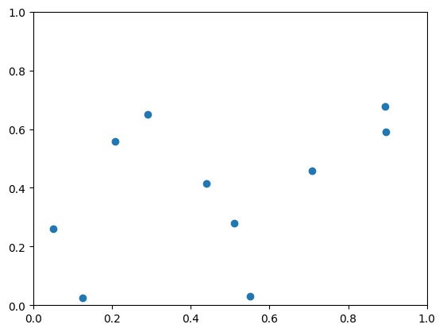
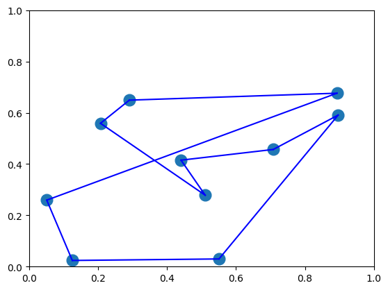

# 概要

巡回セールスマン問題(TSP)を例に取り、JijBenchの使用例を見せる.
制約条件の未定乗数を変化させた際に, 実行可能解の個数と, 目的関数の平均値の変化の関係性をベンチマークによって確認する.

# 巡回セールスマン問題(TSP)

TSPとは, セールスマンが, ある都市を起点にして, 点在する都市を1回ずつ訪問し, 最後に起点の都市に戻る経路を考える際に、移動にかかるコストを最小化する問題のことである.

# TSPの定式化
1人のセールスマンが$N$個の都市を巡回する場合のTSPを数理最適化問題として定式化する.

- $N$個の都市をそれぞれ$c_{i}\,(i\in\{1, \cdots, N\})$で表す,
- 都市$c_{i}$と都市$c_{j}$の間の距離を$d_{ij}$で表す,
- セールスマンが都市を訪れる時刻を$t\in\{0,\cdots,N\}$で表す,
- 時刻$t$にセールスマンが都市$c_{i}$を訪れているかどうかを,
次で定義するバイナリ変数を$x_{i,t}$によって表す:
$$
x_{i,t} :=
\begin{cases}
1 & (\text{時刻$t$に都市$c_{i}$を訪れている}) \\
0 & (\text{otherwise})
\end{cases}
$$
すると, 時刻$t$に都市$c_{i}$を訪れ, 時刻$t+1$に都市$c_{j}$を訪れる場合の移動距離は
$$
d_{ij}x_{t,i}x_{t+1,j}
$$
と表すことができる.
よって, $N$個の都市を巡回する際の総移動距離は, $N+1$番目に訪れる都市は最初に出発する都市であることに注意すると, 次で表されることがわかる:
$$
\sum_{t=1}^{N}\sum_{i=1}^{N}\sum_{j=1}^{N}d_{ij}x_{t,i}x_{(t+1\mod N),\,j} 
$$
この関数の値を最小化することが目的となる.
しかし, 今の設定のTSPでは次の2つの満たすべき条件がある:

1. 位置に関する条件(onehot_location condition); 1つの都市には1度しか訪れない,
$$
\sum_{t=1}^{N}x_{t,i} = 1 \quad (\forall i\in\{1, \cdots, N\})
$$
2. 時刻に関する条件(onehot_time condition); ある時刻にセールスマンが訪れている都市は1つだけ.
$$
\sum_{i=1}^{N}x_{t,i} = 1 \quad (\forall t\in\{1, \cdots, N\})
$$

したがって, TSPはこれらの制約条件のもとで目的関数の値を最小化する$\{x_{t,i}\}_{(i,t)}$を求める条件付き組合せ最適化問題として定式化される.

# JijのプロダクトによるTSPの最適化計算

Jijのプロダクトを使って, 上で定式化したTSPの数理モデルの構築し, それをQUBOへ変換した後, 最適化計算を行う.
[OpenJij](https://openjij.github.io/OpenJij/index.html), [JijModeling](https://www.documentation.jijzept.com/docs/jijmodeling/), [JijModeling-Transpiler](https://www.documentation.jijzept.com/docs/jijmodelingtranspiler/)のドキュメントが参考になる.

## jijmodelingを用いた数理モデルの構築
最適化問題を記述するためのモデリングツールであるJijModelingを用いて, TSPのモデルを構築する.
```bash
pip install jijmodeling
```
jijmodelingでは, `jm.Problem`インスタンスを作成して、それに目的関数や`jm.Constraint`で表される制約条件を追加していく.  その際には, 以下のようなクラスを用いる:
- `jm.Placeholder`; 定数を表す,
- `jm.Binary`; バイナリ変数を表す,
- `jm.Sum`; 和を表す, 
- `jm.Element`;和を取る際の添え字の範囲を表す. 

すると, 先ほど定式化したTSPの数理モデルは次のようにして構築できる.

```python
import jijmodeling as jm

def tsp_model():
    d = jm.Placeholder("d", dim=2) #各都市間の距離を表す2次元配列
    n = d.shape[0].set_latex("n") #都市の数
    x = jm.Binary("x", shape=(n, n)) #バイナリ変数のn行n列の2次元配列
    i, j = jm.Element("i", n), jm.Element("j", n)
    t = jm.Element("t", n)

    problem = jm.Problem("tsp")
    problem += jm.Sum([i, j, t], d[i,j] * x[i, t] * x[j, (t+1)%n]) 
    problem += jm.Constraint("onecity", x[:, t] == 1, forall=t)
    problem += jm.Constraint("onetime", x[i, :] == 1, forall=i)

    return problem

problem = tsp_model()
```

JijModelingで記述された数理モデルは, notebook上ではLaTeXで確認することができる.
```python
problem
```

## JijModeling-Transpilerを用いた数理モデルのQUBOへの変換と, OpenJijを用いた最適化計算

構築した数理モデルを引き渡して最適化計算を行う関数を定義する. (この関数を後でベンチマークする.)
ここではOpenJijとJijModeling-Transpilerを用いる.

OpenJijはイジングモデルとQUBOのヒューリスティック最適化のライブラリであり, JijModeling-TranspilerはJijModelingによって構築した数理モデルを他のモデリングツールへと変換するトランスパイラーである.
```bash
pip install openjij
pip install jijmodeling.transpiler
```

JijModeling-Transpilerを用いて, 先ほどJijModelingを用いて構築した数理モデルをQUBOに変換し, 
それをOpenJijのSamplerクラスのインスタンスによって計算する関数`TSP_solver`を次のように定義する.


```python
import openjij as oj
import jijmodeling.transpiler as jmt

num_reads = 1

def TSP_solver(model, feed_dict, multipliers):
    compiled_model = jmt.core.compile_model(model, feed_dict) 
    pubo_builder = jmt.core.pubo.transpile_to_pubo(compiled_model) 
    Q,offset = pubo_builder.get_qubo_dict(multipliers=multipliers)
    sampler = oj.SASampler(num_reads=num_reads)
    response = sampler.sample_qubo(Q=Q)
    result = jmt.core.pubo.decode_from_openjij(response, pubo_builder, compiled_model) 
    return result
```

`TSP_solver`は, 数理モデルとして`jm.Problem`インスタンス, 係数と未定乗数として辞書を引数として, その最適化計算の結果を返す関数である. ただし, `num_reads`とは量子アニーリングにおける試行回数を表す. ここでは例として1回とした.

## 計算例

上で定義した`problem`クラスと`TSP_solver`を用いてTSPを解く実演をする. 

まず$n$個の都市をランダムにとり, それぞれの都市間の距離を表す配列を求める関数を定義する.

```python
import numpy as np

def tsp_distance(n):
    np.random.seed(3)
    x = np.random.uniform(0, 1, n) 
    y = np.random.uniform(0, 1, n) 
    XX, YY = np.meshgrid(x, y) 
    distance = np.sqrt((XX - XX.T)**2 + (YY - YY.T)**2)
    return distance, (x, y)
```

例として次の場合を考える:

- 都市の数; 10個
```python
n = 10 #都市の数
d, positions = tsp_distance(n) 
x = positions[0]
y = positions[1]

plt.plot(x, y, 'o')
plt.xlim(0, 1)
plt.ylim(0, 1)
```

都市の数と各都市間の距離を表す行列の情報は, 辞書として格納しておく.

```python
instance_data = {"n":n, "d":d} 
```


- 未定乗数; 2つの制約条件(onehot_location, onehot_time)に対して共に0.5
```python
multipliers_sample = {"onehot_location":0.5,"onehot_time":0.5} 
```

これらのパラメータを`TSP_solver`に引き渡し, 得られた結果から都市を巡る経路をプロットする.

```python
import matplotlib.pyplot as plt

result_sample = TSP_solver(problem, instance_data, multipliers_sample)

sparse_index_sample,value,_ = result_sample.record.solution['x'][0]

time_indices, city_indices = zip(*sorted(zip(*sparse_index_sample))) 

x = positions[0]
y = positions[1]
plt.plot(x, y, 'o',markersize=12)
plt.xlim(0, 1)
plt.ylim(0, 1)

for i, city_index in enumerate(city_indices[:-1]):
    next_city_index = city_indices[i+1]
    plt.plot([x[city_index],x[next_city_index ]],[y[city_index],y[next_city_index ]],c = "blue")

plt.plot([x[city_indices[-1]],x[city_indices[0]]],[y[city_indices[-1]],y[city_indices[0]]],c = "blue")

plt.show()
```



# JijBenchを用いたベンチマーク

この章の本題である, JijBenchを用いた, パラメータを変化させた時のベンチマークを実演する.
```bash
pip install jijbench
```

ここでは例として, 未定乗数を変化させた時のベンチマークを行う.
まず, ベンチマークする未定乗数のリストを作成する関数を定義する.

```python
import itertools
import numpy as np

def make_multipliers_list(lower_bound, upper_bound, dividing_number, constraint1, constraint2):
    param_range = np.linspace(lower_bound, upper_bound, dividing_number) 
    multipliers_list = itertools.product(param_range, repeat=2)
    multipliers = []
    for p0, p1 in multipliers_list: 
        multipliers.append({constraint1:p0,constraint2:p1})
    return multipliers
```

例として, $0.3$から$1.0$までを5等分した値の組み合わせをリストアップしてみる. 

```python
multipliers_list = make_multipliers_list(0.3, 1.0, 5, "onehot_location", "onehot_time")
```

いよいよJijBenchを使ってベンチマークを行う. ベンチマークする関数として定義した`TSP_solver`を指定して, `TSP_solver`の引数の`model`, `feed_dict`, `multipliers`に対して, ベンチマークしたいリストを引き渡す. 

```python
import jijbench as jb

bench = jb.Benchmark(
    solver=TSP_solver,
    params={
        "model":[problem],
        "feed_dict":[instance_data],
        "multipliers":multipliers_list,
    }
)

experiment = bench()

#(テーブルにデータを追加する)

df = experiment.table
```

# 結果の確認


